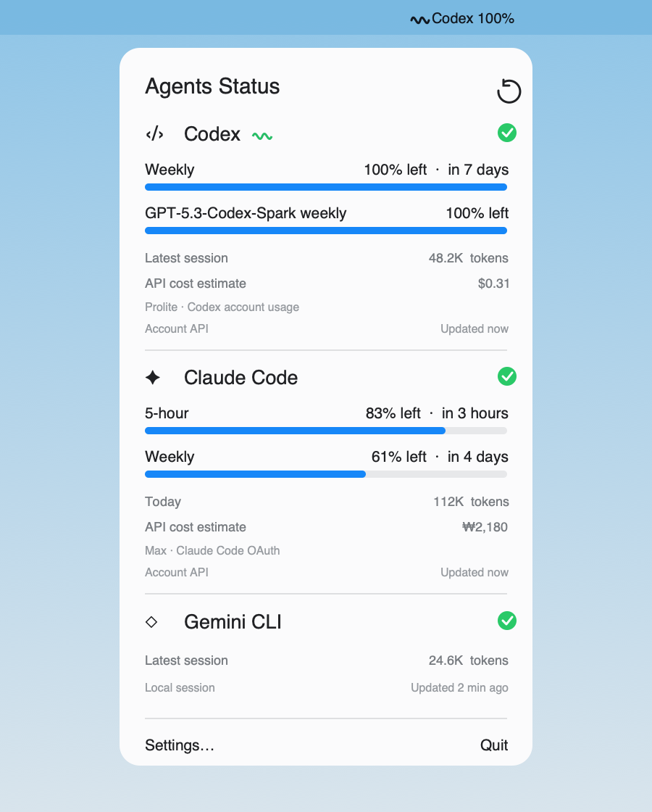

# Agents Status Bar

[English](README.md) | **한국어**

AI 코딩 에이전트의 남은 사용량을 보여주는 개인정보 보호 중심의 macOS 메뉴바 앱입니다.

<p align="center">
  
</p>

> 스크린샷은 샘플 값을 사용하며 실제 계정 정보는 포함하지 않습니다.

## 주요 기능

Agents Status Bar는 자주 확인하는 사용량 정보를 하나의 작은 메뉴에 모아 보여줍니다.

- 남은 쿼터, 초기화 시간, 로컬 토큰 사용량 표시
- API 단가 기준 토큰 비용을 달러 또는 원화로 추정
- 관측 비용 기록과 선택 가능한 월 예산 진행률 및 50%, 80%, 100% 알림
- 적용한 ECB 환율과 환율 기준일을 표시하고 USD/KRW를 매일 갱신
- 1일, 7일, 30일 차트를 제공하는 30일 로컬 사용량 기록
- 데이터 출처와 마지막 성공 갱신 시간 표시
- 제공자별 경고 및 위험 알림 기준 설정
- 메뉴바에서 가장 낮은 잔여량 바로 확인
- Codex, Claude Code, Grok 지원
- 1분 주기 자동 새로고침 및 수동 새로고침
- 로그인 시 자동 실행 설정
- 제공자별 활성화 및 비활성화 설정
- 시스템 설정, 한국어 또는 English 중 직접 선택할 수 있는 UI 언어
- 일반, 알림, 사용량 및 개인정보로 구분된 탭형 설정 화면
- UI 변경 없이 새로운 에이전트를 추가할 수 있는 확장 가능한 제공자 프로토콜

모든 쿼터 비율은 **남은 사용량**(`% left`)을 기준으로 표시합니다. 공식 사용량 API가 필요한 경우에만 기존 CLI 인증정보를 메모리에서 사용합니다. 프롬프트, 응답, 쿠키, 액세스 토큰 및 리프레시 토큰은 저장하지 않습니다.

## 제공자 지원 현황

| 제공자 | 계정 쿼터 | 로컬 사용량 | 데이터 소스 |
| --- | --- | --- | --- |
| Codex | 주간 및 모델별 한도 | 최근 세션 토큰 | 기존 Codex 로그인 및 `~/.codex/sessions` |
| Claude Code | 5시간, 주간 및 모델별 한도 | 오늘의 중복 제거 토큰 | 기존 Claude Code 키체인 로그인 및 `~/.claude/projects` |
| Grok | 아직 지원하지 않음 | 현재 컨텍스트 사용량 | `~/.grok/sessions` |

각 CLI의 파일 형식과 사용량 API는 공개 호환성 규격이 아니므로 변경될 수 있습니다. 계정 조회가 실패하면 임의의 값을 만들지 않고 확인 가능한 로컬 데이터로 대체합니다.

## 비용 추정과 환율

비용은 로컬에서 확인한 토큰을 공개 API 단가로 사용했을 때의 **추정액**입니다. Codex, Claude, Grok, ChatGPT 또는 Claude 구독에서 실제로 청구되는 금액이 아닙니다.

- Codex는 모델을 식별할 수 있는 가장 최근 로컬 세션을 계산합니다.
- Claude는 오늘의 중복 제거된 로컬 메시지를 계산하며 입력, 5분·1시간 캐시 쓰기, 캐시 읽기 및 출력을 구분합니다.
- Grok 로컬 신호에는 과금 가능한 입력·출력 구분이 없어 아직 비용을 계산하지 않습니다.
- 알 수 없는 모델은 임의 단가에 연결하지 않고 비용을 표시하지 않습니다.

월 합계는 누적 비용 샘플의 증가분과 사용 범위 초기화를 바탕으로 계산합니다. 앱이 실행되어 기록을 남긴 동안 관측된 사용량만 포함하므로 실제 청구 내역이 아닌 추정치입니다.

버전 관리되는 모델 가격표는 공식 [OpenAI 모델 가격](https://developers.openai.com/api/docs/models)과 [Anthropic 가격](https://platform.claude.com/docs/en/about-claude/pricing)을 따릅니다. 앱은 하루 한 번 이 저장소의 새 가격표를 확인하고, 잘못된 스키마·다운그레이드·동일 버전 변경·비정상 가격·신뢰하지 않는 출처를 거부하며 앱 내장 가격표와 검증된 캐시를 fallback으로 유지합니다. USD/KRW 환율은 [Frankfurter](https://frankfurter.dev/)의 ECB 제공자를 통해 한국 시간 기준 하루 한 번 확인합니다. 설정 화면에 가격표 버전, 적용 환율 및 각 기준일을 표시하며, 주말이나 휴일에는 가장 최근 ECB 기준일의 환율이 사용될 수 있습니다.

## 설치

`v0.3.1` 미리보기는 macOS 14 이상과 Apple Silicon을 지원합니다.

### Homebrew

```bash
brew tap 90ms/agents-status-bar https://github.com/90ms/agents-status-bar
brew install --cask 90ms/agents-status-bar/agents-status-bar
open -a "Agents Status Bar"
```

삭제 방법:

```bash
brew uninstall --cask agents-status-bar
brew untap 90ms/agents-status-bar
```

### GitHub Release

[Releases](https://github.com/90ms/agents-status-bar/releases)에서 `AgentsStatusBar-0.3.1.zip`을 내려받아 압축을 풀고 `Agents Status Bar.app`을 `/Applications`로 옮깁니다.

현재 미리보기는 Apple Developer ID 인증서가 없어 ad-hoc 서명되어 있습니다. 처음 실행할 때 **시스템 설정 → 개인정보 보호 및 보안**에서 앱 실행을 허용해야 할 수 있습니다. Developer ID 서명과 공증은 이후 릴리스에서 지원할 예정입니다.

### 소스에서 빌드

필요 환경: macOS 14 이상, Swift 6.2 이상, Apple Command Line Tools.

```bash
git clone https://github.com/90ms/agents-status-bar.git
cd agents-status-bar
./Scripts/test.sh
./Scripts/package_app.sh
open "dist/Agents Status Bar.app"
```

`Scripts/package_app.sh`는 기본적으로 ad-hoc 서명을 사용합니다. 다른 로컬 서명 인증서를 사용하려면 `APP_SIGN_IDENTITY`를 설정하세요.

## 앱을 열기 전에

모니터링할 커맨드라인 에이전트에 먼저 로그인하세요.

```bash
codex
claude
grok
```

설치되어 있고 로그인된 제공자만 사용량을 표시할 수 있습니다. 사용하지 않는 제공자는 설정에서 끌 수 있습니다.

## 구조

```text
ProviderRegistry
    ├── CodexUsageProvider  ── 계정 사용량 + ~/.codex/sessions
    ├── ClaudeUsageProvider ── 계정 사용량 + ~/.claude/projects
    └── GrokUsageProvider   ── ~/.grok/sessions
               │
               ▼
        ProviderSnapshot
               │
               ▼
           UsageStore
               │
               ▼
       SwiftUI MenuBarExtra
```

`ProviderID`는 enum이 아니라 확장 가능한 문자열 기반 타입입니다. 새로운 플랫폼을 추가하려면 `UsageProviding`을 구현하고, 인증과 파싱 코드를 제공자별 디렉터리에 두고, 개인정보가 제거된 fixture 테스트를 추가한 다음 `ProviderRegistry`에 등록하면 됩니다.

## 개발

```bash
./Scripts/test.sh
swift build
./Scripts/package_app.sh
```

프로젝트에는 fixture 기반 파서 테스트와 macOS GitHub Actions 빌드가 포함되어 있습니다. 기여 규칙은 [AGENTS.md](AGENTS.md)를 참고하세요.

## 개인정보 보호 및 보안

- 프롬프트와 모델 응답을 표시 목적으로 읽거나 저장하지 않습니다.
- 인증정보를 로그에 남기거나 앱 저장소로 복사하지 않습니다.
- Codex와 Claude 사용량 요청은 각 CLI의 기존 로그인 세션을 재사용합니다.
- 로컬 파싱은 에이전트 세션 디렉터리의 알려진 사용량 필드로 제한됩니다.
- 사용량 기록에는 집계된 비율과 토큰 합계만 Application Support에 30일 동안 저장합니다.
- 환율 캐시에는 공개 환율, 고시 기준일 및 확인 시각만 저장합니다.
- 가격표 캐시에는 공개 모델 식별자, 단가, 적용일 및 공식 출처 링크만 저장합니다.
- 분석 도구나 텔레메트리를 사용하지 않습니다.

## 라이선스

[MIT](LICENSE)
